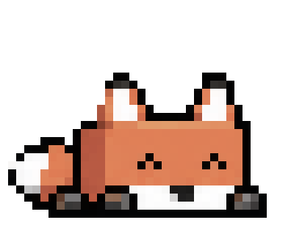
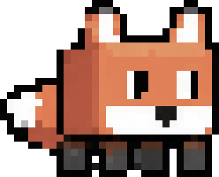

  

    <h1>Alexis Fox</h1>

    
    
I am a 3rd-year CS undergraduate at Duke University.

    

      
<a href="mailto:alexis.fox@duke.edu">Email</a> / <a href="https://scholar.google.com/citations?view_op=list_works&hl=en&authuser=2&hl=en&user=iVIop8YAAAAJ&authuser=2">Google Scholar</a> / <a href="https://github.com/foxden09">Github</a> / <a href="https://www.linkedin.com/in/alexis-fox7/">Linkedin</a>

    

    <!--
     

    
I previously worked with <a href="https://www.linkedin.com/in/claytonkerce/">Clayton Kerce</a> at GTRI, and with   <a href="https://biocomplexity.virginia.edu/our-team/samarth-swarup">Samarth Swarup</a> & <a href="https://biocomplexity.virginia.edu/our-team/abhijin-adiga">Abhijin Adiga</a> at UVA's Biocomplexity Institute.

    -->
    <!-- / <a href="[cv-link]">CV (Month Year)</a>  -->
  

  
  

    
  

## Blog
[Hill-climbing ARC-AGI-3](https://blog.alexisfox.dev/arcagi3) ~ Mar 2026

## Publications
**PRO-LONG: Programmatic Memory Enables Long-Horizon Reasoning** \\
*<u>Alexis Fox</u>, Junlin Wang, Paul Rosu, Bhuwan Dhingra*  \\
arXiv preprint, 2026

[[Paper](https://arxiv.org/abs/2607.20064)] [[Code](https://github.com/alexisfox7/PRO-LONG)]

**A Unifying Information-theoretic Perspective on Evaluating Generative Models** \\
*<u>Alexis Fox</u>, Samarth Swarup, Abhijin Adiga*  \\
Proceedings of the AAAI Conference on Artificial Intelligence 2025  \\
Oral (5%)

[[Paper](https://arxiv.org/abs/2412.14340)] [[Code](https://github.com/NSSAC/PrecisionRecallMetric)]
